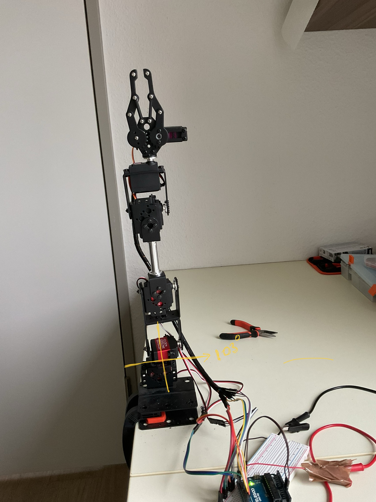
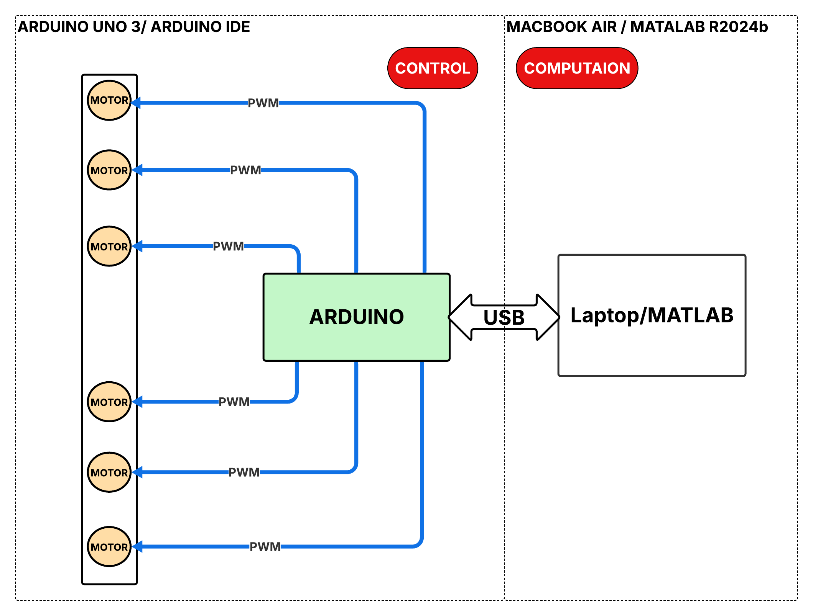
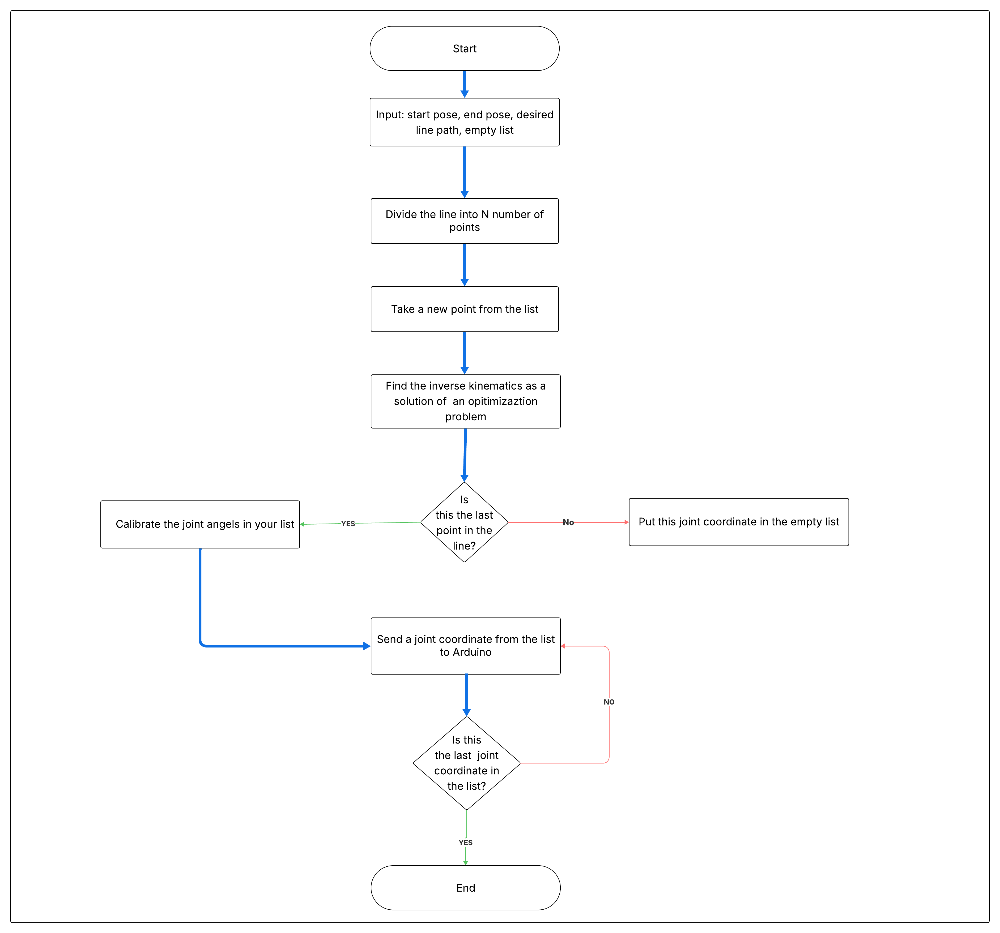
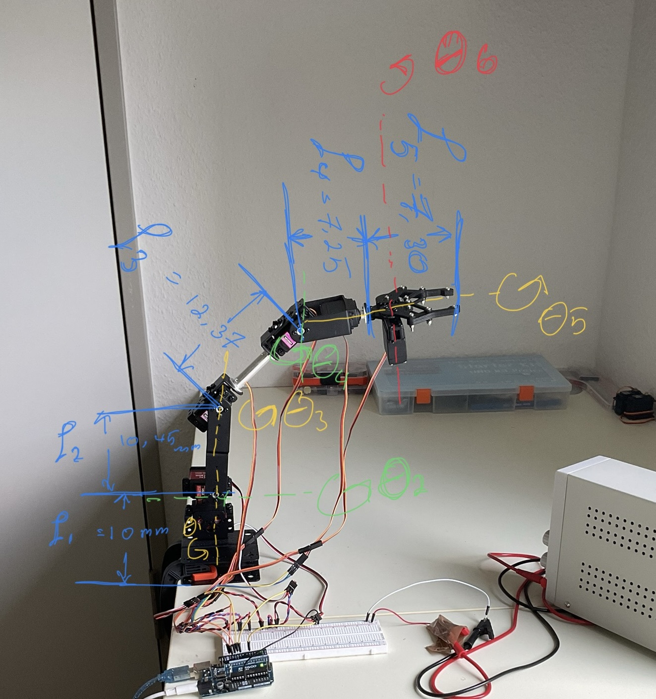
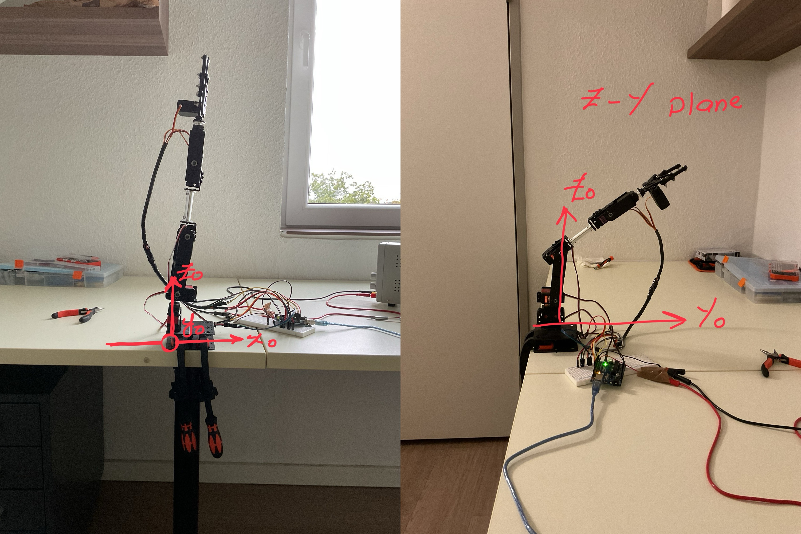

# Samrt Arm
The Smart Arm is servo motor 6-DOF manipulator that is capable of moving its end-effector in a desirable trajectory. The arm can reach a certain configuration of motor angels input (Forward Kinematics). And Its also move to a certain pose, cartesian coodinates with its orientation or perform an inverse kinematics.

# Arm Architecture
The system of the Smart Arm has two major components. A control part that is run by a microcontroller(Arduino), which is responsible for reaching a certain configuration of the Arm. The user suggests a configuration, that is a set of values of the motors angels, and Arduino will rotate all the motors simulataneously to move the specified input angels and thus reach the configuration.
The second component is the computation part(MATLAB). This part runs on a laptop in MATLAP. It performs the necessary calculation for the inverse kinematics and the trajector planning. It communicates with Arduino via USB cable.

# System Rationale
- The forward kinematics is perfromed directly by sending the joint angels to Arduino, this could be hard coded or sent via the serial port. The serial port could be used by MATLAB as well to send the values of the joint angels
- The Interpolation of the points on a straight line is performed as detailed below:
 

 # Denavit-Hartenberg Parameters
| Gelenk   | Theta_i           |   d_i   |   a_i  |    alpha   |
| ---------| -------------     |   ------|--------|------------|
| Base     | theta1            |    L1   |    0   |    -pi/2   |
| Shoulder | (-pi/2) + theta2  |    0    |   L2   |      0     |
| Elbow    | -theta3           |    0    |   L3   |      0     |
| Wrist    | theta4            |    0    |   L4   |      0     |
| Wrot     | theta5            |    L5   |    0   |      0     |
| Gripper  | theta6            |    0    |   0    |      0     |

# Demonstarions
-Forward Kinematics

-Inverse Kinematics

# Wiring Diagram
